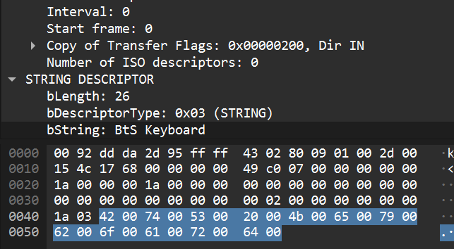

# 🐒 Monkey See — Forensics CTF Writeup

## 🧠 Initial Observation

When opening the `.pcap` file, we can see that it's a **USB communication** between a peripheral device and the system. By analyzing the packets and the **USB Device Descriptor** (see Figure 1 below), we can determine that the device used is a **USB Keyboard**.


Therefore, the goal of this challenge is to **reconstruct what the user typed**, in order to find the hidden flag.

---

## 🔍 USB Data Analysis

After inspecting the communication, I noticed that the packets contain the field `usb.capdata` with HID-formatted data. However, unlike typical challenges with **8-byte HID reports**, this one uses **9 bytes**.

Here is a sample of the extracted data:

```
010000170000000000
010000000000000000
010000150000000000
010000000000000000
```

Closer observation reveals:

- The first byte `01` is repeated frequently.
- The third byte is `17`, `15`, `04`,... — all valid HID keycodes (`t`, `r`, `a`,...).

This suggests that we should **discard the first byte** and only use the remaining 8 bytes for decoding.

---

## 🛠 Supporting Tool

I found a helpful open-source tool:

> 🔗 [5h4rrk/CTF-Usb_Keyboard_Parser](https://github.com/5h4rrk/CTF-Usb_Keyboard_Parser.git)

However, this tool **does not work properly with 9-byte HID reports**, as it assumes 8 bytes starting from the first byte. Thus, we need to **modify the source code** to skip the first byte and process only byte 2 to byte 9.

---

## 🧪 Extracting HID Data with Tshark

First, extract `usb.capdata` data using the following command:

```bash
tshark -r monkey-see.pcapng -T fields -e usb.capdata > hid_data.txt
```

---

## 🔧 Modified Parser for 9-byte HID

I created a new script called `9byteHIDKeyBoardcode.py` with the following content:

```python
import subprocess, sys, os
import shlex

usb_codes = {
    "0x04": ['a','A'], "0x05": ['b','B'], "0x06": ['c','C'], "0x07": ['d','D'],
    "0x08": ['e','E'], "0x09": ['f','F'], "0x0A": ['g','G'], "0x0B": ['h','H'],
    "0x0C": ['i','I'], "0x0D": ['j','J'], "0x0E": ['k','K'], "0x0F": ['l','L'],
    "0x10": ['m','M'], "0x11": ['n','N'], "0x12": ['o','O'], "0x13": ['p','P'],
    "0x14": ['q','Q'], "0x15": ['r','R'], "0x16": ['s','S'], "0x17": ['t','T'],
    "0x18": ['u','U'], "0x19": ['v','V'], "0x1A": ['w','W'], "0x1B": ['x','X'],
    "0x1C": ['y','Y'], "0x1D": ['z','Z'], "0x1E": ['1','!'], "0x1F": ['2','@'],
    "0x20": ['3','#'], "0x21": ['4','$'], "0x22": ['5','%'], "0x23": ['6','^'],
    "0x24": ['7','&'], "0x25": ['8','*'], "0x26": ['9','('], "0x27": ['0',')'],
    "0x28": ['\n','\n'], "0x29": ['[ESC]','[ESC]'], "0x2A": ['[BACKSPACE]','[BACKSPACE]'],
    "0x2B": ['\t','\t'], "0x2C": [' ',' '], "0x2D": ['-','_'], "0x2E": ['=','+'],
    "0x2F": ['[','{'], "0x30": [']','}'], "0x31": ['\\','|'], "0x32": ['#','~'],
    "0x33": [';',';'], "0x34": ["'",'"'], "0x36": [',','<'], "0x37": ['.','>'],
    "0x38": ['/','?'], "0x39": ['[CAPSLOCK]','[CAPSLOCK]'], "0x3A": ['F1'], "0x3B": ['F2'],
    "0x3C": ['F3'], "0x3D": ['F4'], "0x3E": ['F5'], "0x3F": ['F6'], "0x41": ['F7'],
    "0x42": ['F8'], "0x43": ['F9'], "0x44": ['F10'], "0x45": ['F11'], "0x46": ['F12'],
    "0x4F": ['→','→'], "0x50": ['←','←'], "0x51": ['↓','↓'], "0x52": ['↑','↑']
}

def keystroke_decoder(filepath, field):
    out = subprocess.run(shlex.split(f"tshark -r {filepath} -Y "{field}" -T fields -e {field}"), capture_output=True)
    output = out.stdout.split()
    message = []

    for raw in output:
        buffer = str(raw)[2:-1]
        if len(buffer) < 18:
            continue

        buffer = buffer[2:]
        modifier_hex = buffer[0:2]
        keycode_hex = buffer[4:6]

        keycode = f"0x{keycode_hex.upper()}"

        if keycode == "0x00":
            continue
        if keycode == "0x2A" and message:
            message.pop()
            continue
        if keycode in usb_codes:
            modifier = int(modifier_hex, 16)
            is_shift = modifier & (1 << 1) or modifier & (1 << 5)
            message.append(usb_codes[keycode][1 if is_shift else 0])
    return message

if len(sys.argv) != 2 or not os.path.exists(sys.argv[1]):
    print("\nUsage : python 9byteHIDKeyBoardcode.py <pcap_file>")
    exit(1)

filepath = sys.argv[1]
result = ''.join(keystroke_decoder(filepath, "usb.capdata"))

print("\n[+] Retrieved keystrokes:\n")
print(result)
```

---

## 🎯 Result

After running the script:

```bash
python3 9byteHIDKeyBoardcode.py monkey-see.pcapng
```

We get:

```
resink transversomedial pharyngopathy postmineral myelosyphilis silverer evincement phrygium punnigram imminution environmental sleepify nope wauken indignance knotwort apocodeine escortee dogwatch eaglewood unbrotherliness mulse dermobranchiata typhic poststertorous indevout anatomicopathologic unimpenetrable hoggy urrhodin Dioecia unchapter nonumbilicate zwitterionic apportionable ferulic statefulness pharyngotonsillitis Mimulus recce mutinously reboant skibidi toilet chromatophilic lauder nirles esthesiometer semisocial unbeing kangaroo takosis inconvertibility anesthetist rumorproof thoracoscopy euphorbium bizet song dolichocephali platemaker vesicupapular electroforming dilatingly meethelp loincloth avowably counterindicate treacliness Epigonus airmark polarography precomposition lemography Apinage Taal logology probeer randomization poditic individualize castigate Biloculina overscrub koolah weetless erased layery discontinuee anaphylatoxin unwounded personalism howitzer hexahydroxy koku reamer tonguiness microgametocyte baba ludefisk novelwright swinehull Odonata indefinable faineance nidologist supracargo beriberic betso archheart snary Viminal Pygopodidae acetylenediurein asphalt preimpress fountainlet bejel unpictorially heliophyte chimopeelagic warison antivaccinist overtwine preremove nerval bufonite eradicator turtling winrace psychographic impalpably amygdalase Octogynia brimming grist casave brazilein afluking meliceris portative unsteck Madelon barramunda optotechnics metapterygium unromanticalness Jacobinism pricklingly blameless elderhood committeewoman comicocynical aggrate stentoronic flatwise bipyridyl untastable aegerian unmistrusted quadrigamist Meleagrinae helvite neuralist Swietenia unpleadable colorably mogilalism consequently atamasco inhospitality noncarnivorous counterruin gryposis ringe displeasedly incenter gallycrow whincow repudiationist unagile chaplain bekerchief subproduct pointingly Physonectae bumpingly hateful endogenous facticide velours carmoisin reaccomplish protistic recuperance tech withywind Galen Slavistic escropulo deglutination hydramnios Amphion beguilement glottiscope propagation entrancement disbelief goatlike Tanyoan thecium deforciant coachwhip enviableness duroquinone smirchy whisky forcing homosystemic underact autosyndesis sybaritism scorching testiere nonporphyritic cephalhematoma oxyquinoline azo scrimshorn unreeling burnt kilocycle lactenin Decimus patter jetbead Pygidium bitterroot thoke septated trinodal qualitied gotten unclassable Akhissar wholewise curse organophyly teleseme heptitol whitehass asclepiadeous labionasal presumptuous triketo thrombolymphangitis spokeswomanship unprejudicial ungoverned nonrectangular pleocrystalline slurbow unhandsome scoliotic phreatophyte criminalistics imitability zygozoospore nonliability disafforestation epigenetic Aves schistaceous verbomania epitenon proscriber histology propulsion elaidinic driftless upcover duteous distasteful dermatoxerasia Kaibartha spydom tonsor paedogenesis anticipatory unastonished Blackbeard gradient metachemistry caravan circumnutate infract adenia louse koel tributyrin lifey Desmidiaceae vinelet ingrowth uniovulate toying nonretentive conjunct pinnaglobin vastity appendicle redecline trekker hereby dicatalexis slackerism inaxon tribase cryptostome nonpresbyter breezily opusculum methought yarl fringent forsooth plicater balneotherapeutics uredosporic perceptive embouchure heterolysis imperence perfervidness pobs thorax perikronion charlatanic Bonapartism whilom outferret kelty macrospore predisposedly squawk extrafoliaceous inveteracy obtect decoyer Pelecaniformes dodecane gambet electrodynamism henter sunless burroweed busket trepidatory fermerer prewound thrifty twibil amateur myasthenia goave toolmark ornithon geminately unrhymed Serridentines presbyopia unoperably preventer salten grimily conduplicated theomania gyromagnetic antimycotic malacanthid sensationistic vibraculoid eater zig bordello hounding outweary hoyle nonrendition potlike surflike rubification dulcifluous Saturnalian unconfidence Apneumona hedgy subharmonic undisputed monotypic pontifex Phalarism precursive uncock echinoderm antu rollick natricine presuperintendence pinnaclet precondemnation Atheriogaea volumescope Austrophilism stinking wildness noncoloring spaying somniloquy xi hierogrammatical winer ironback tarnside lampers handcraft glossophagine philophilosophos nonconcludent overaccumulate disbutton kinetomer thermostimulation stenogastric ovoviviparously recept firetop roughroot Muncerian prefiction Ovinae reactivity oncin pointer absolve unaccommodatingly telson ayelp rebegin unhomely Octavian scope Pentelic revocability juvenal spinobulbar erinaceous hield anaglyph strongylid strangling kala fibroplastic adactyl Pauline undispellable Frederick amylopsin informative Sisseton roominess unsurpassableness painstaker saturator BtSCTF{m0nk3y_tYpE!!1!!oneone!} foliature unfructuously gold fractionally sparkless conceptional kettledrummer inventory knoxvillite indeformable Honduran beennut unelementary epicranial Anopla Anselm strabismical declarative agricultural abdominous Hansardization profanely untwisted tipstaff prederivation scrollwise unrefusingly soulfulness spyfault raiseman beroll oscheoplasty Lentibulariaceae onagraceous Nora eellike semiupright Tatary ninut baseball unifoliolate nextly shamefacedly unharbor omphaloncus sweatband premake hook fitchee sendable xyloid Lin preindication alpine planarioid mastlike servitude patterny goffering unfrightened genderer cafeneh forthwith intermenstruum bluggy buzylene faceteness Placophora mispleading sniffly dredge neurocity terminable trest stythe pitchometer breaker glossarize macrosymbiont perisphere torse garter ring bedstring hawserwise pyrocellulose soho silklike ateleological kinematic nectariferous freezer Byronic congressionist dandruffy Balkar tonsillectome crooningly hypodorian interregnum mystificatory flanched nonimmigrant ophthalmomalacia unhero meningocortical apologizer Jatulian nystagmus bailer worldling preadjunct deprivative babblishly ganglioid themeless gastrohelcosis housewifeliness psychoanalyzer pyelolithotomy ethmoid cyclomania cyathium fiduciary upher ethnize hexastemonous echinodermic sigillarian grubbiness overeducate flyflap tart statometer sixpence Capernaitish Delsartean celery astragalus overjoyful synactic unexceptionably Orobanche driblet rampire Mil wellington unepic pondage octocentenary Ansel unmackly nonfermentative silk angiolith sparrer frigorify preofficially bridle princeps pentathionic doltishness trunkless Idiosepiidae autohypnotization lingenberry nonsetting prescapula proagrarian nonlover bumbaste aischrolatreia tupanship proctoclysis basilweed counternoise interparietale Saccobranchiata tonga iceland mandelic monkeyish fanon sled taxine rattlingly monolithic oxbiter scelerat primitivism grapnel recreative plumbum enthusiastical stomachlessness busher uninsured unobjective collyrium aspheterism mantology monk troolie ghaist unplebeian fusible unjagged lazaret childlike Sid dihydroxy extractible hammy impetition rissel principalness parsonage yogoite extratension bombastic reblow Phajus merchantableness Dyophysitism attainability mycomycete unequated exalate rerun pneumonic supersympathy commenceable borele telemetric muskellunge eutropic Actaeon consentiently deferment microdrawing behammer Acacian guanaco unkillable eave empyrean nondivergent dubitatingly existentially pelvisternum Siva Birkenhead sneeshing Inodes worriedness outdraft squandermania
```

---

## 🏁 Flag

```
BtSCTF{m0nk3y_tYpE!!1!!oneone!}
```

---

## 📌 Conclusion

- USB communication can be exploited to reconstruct keyboard inputs.
- Always verify the number of bytes in HID reports — especially if tools fail to decode properly.
- Adapting scripts to handle different formats is a key skill in USB forensics!
